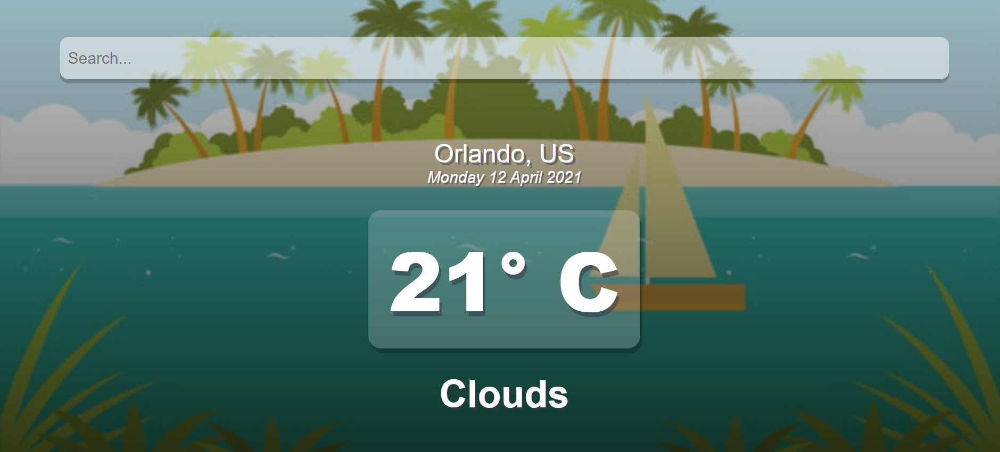
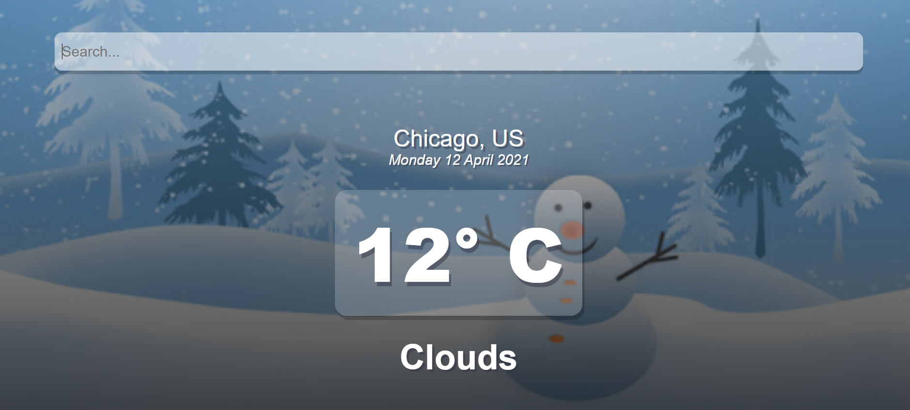

# WEATHER APP

This project is a **REACT-APP** which can fetch the climate data of any region based on the query passed on to it and display it in it's UI. The app makes use of a public API which passes on the climate data by means of POST query method.

## Functioning

- The UI of the app has been designed by me. The app makes use of two backgrounds, one symbolises _Summer Weather_ and other symbolizes _Winter Weather_.
- Based on the temperature of the region, the app uses a background supporting the temperature of the region.
- If the temparature of a region is _greater than_ 16° C, then the background would be like:

  
- If temperature of a region is _less than_ 16° C, then the background would be like:

  
